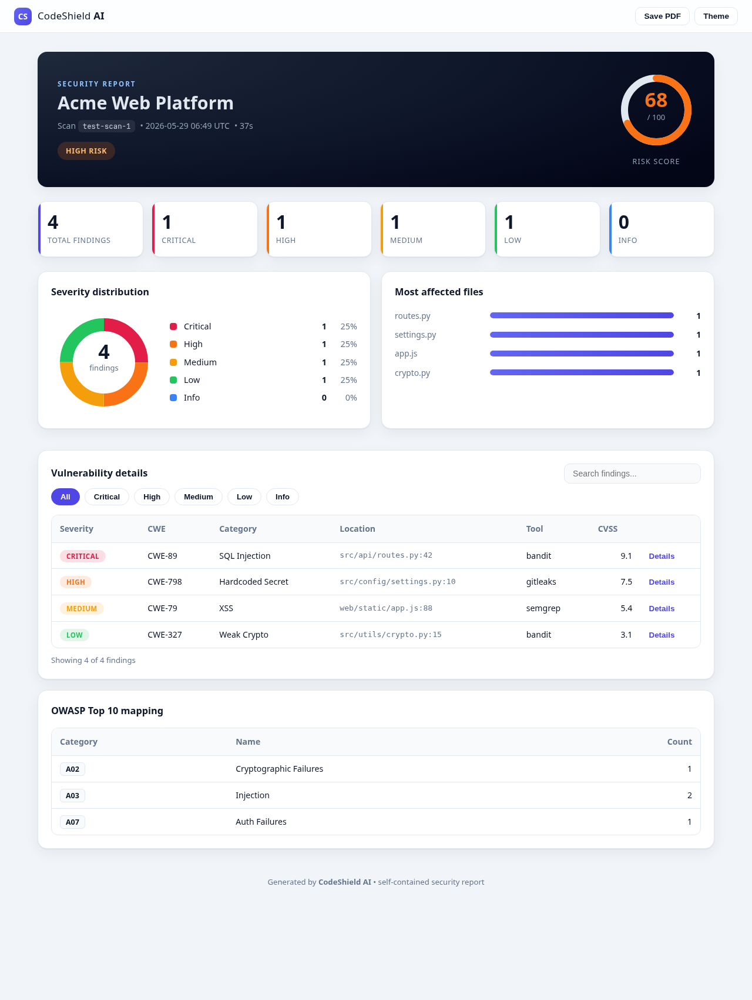
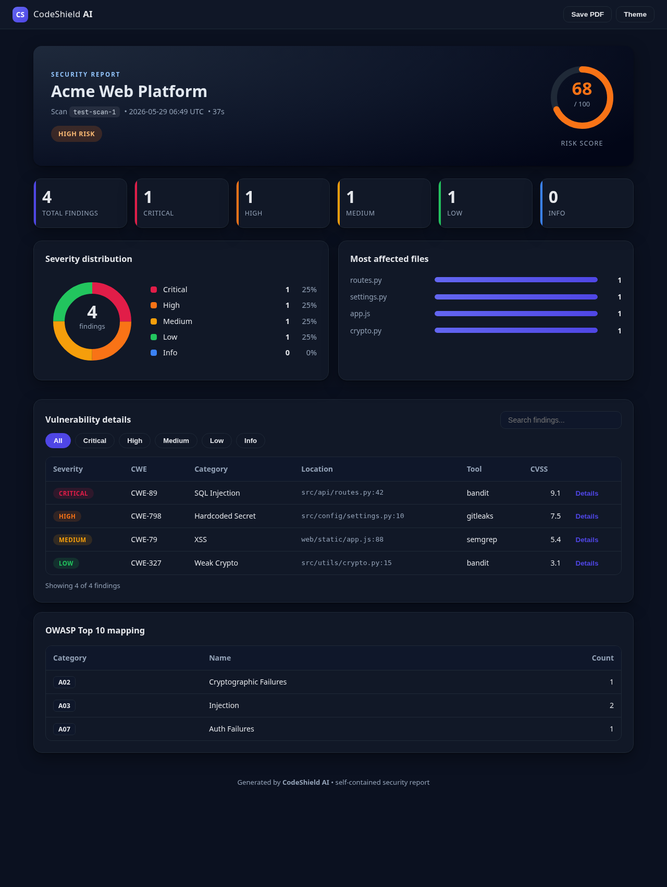
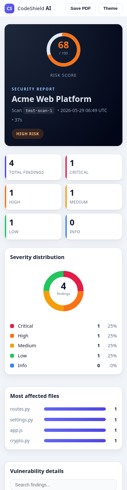

# CodeShield AI

**Production-ready application security platform** — multi-scanner SAST, secret & dependency analysis, an agentic AI "security team", Responsible-AI governance, and a modern, fully responsive HTML report.


CodeShield AI ingests code via ZIP upload or GitHub URL, auto-detects languages, runs the appropriate security scanners in parallel (coordinated by a multi-agent orchestrator), validates findings with AI triage, and produces structured results plus self-contained PDF/HTML reports.

---

## Table of Contents

- [Features](#features)
- [Agentic AI, LLM Providers & Responsible AI](#agentic-ai-llm-providers--responsible-ai)
- [HTML Report UI](#html-report-ui)
- [Architecture](#architecture)
- [Quick Start](#quick-start)
- [API Documentation](#api-documentation)
- [Scan Configuration](#scan-configuration)
- [Data Models](#data-models)
- [Available Scanners and Detections](#available-scanners-and-detections)
- [Development](#development)
- [License](#license)

---

## Features

### Core scanning
- **Multi-language**: Python, JavaScript/TypeScript, Java, Go, Ruby, PHP, C#, and more
- **8 integrated scanners**: Semgrep, ESLint, Pylint, Bandit, PMD, Gitleaks, OWASP Dependency-Check, and a dependency-free Custom AI Scanner
- **Async & parallel**: all scans run asynchronously with live progress tracking
- **Language auto-detection**: scanners are selected from detected languages
- **Standardized output**: every tool is normalized to a common `Vulnerability` model with CWE/OWASP mapping
- **Graceful degradation**: scans continue even when some tools are not installed

### Intelligence & automation
- **Multi-agent orchestrator (HAL)**: coordinates SAST / DAST / secrets / SCA / taint / LLM agents across phases
- **AI triage**: hybrid heuristics plus optional LLM to cut false positives
- **Auto-fix**: deterministic and LLM-assisted remediation with unified diffs
- **Agentic "AI team"**: role-based agents (Planner, Researcher, Engineer, Reviewer, Responsible-AI Officer) — see below
- **Responsible AI governance**: PII redaction, prompt-injection guards, bias screening, and a hash-chained audit trail

### Reporting & delivery
- **Modern, responsive HTML report** (light/dark, inline SVG charts, search and filters) — see [HTML Report UI](#html-report-ui)
- **PDF reports** with charts, code snippets, and an OWASP matrix
- **Exporters**: SARIF, JSON, JUnit, HTML
- **CI/CD generators**: GitHub Actions, GitLab CI, Jenkins, Azure Pipelines

## Agentic AI, LLM Providers & Responsible AI

Beyond security scanning, the platform now includes a general-purpose **agentic
AI** stack with Responsible AI baked in. See the docs for the full design:

- **[Agentic AI Architecture](docs/AGENTIC_AI_ARCHITECTURE.md)** — system design, diagrams, request lifecycle.
- **[Responsible AI](docs/RESPONSIBLE_AI.md)** — principles → controls map, policy, model card.
- **[AWS EC2 Deployment + Claude CLI](docs/DEPLOYMENT_AWS_EC2.md)** — hands-on setup.

Three composable subsystems:

| Package | What it provides |
| --- | --- |
| `llm/` | Swappable LLM provider layer: **Claude CLI**, Anthropic API, OpenAI API, and an offline mock — selected via `get_llm_provider()` / `CODESHIELD_LLM_PROVIDER`. |
| `governance/` | Responsible AI governor enforcing **PII/secret redaction, prompt-injection guards, bias screening, a hash-chained audit trail**, and a declarative policy. |
| `ai_team/` | An agentic **"AI team"** (Planner, Researcher, Engineer, Reviewer, Responsible-AI Officer) coordinated to accomplish a goal — every LLM call routed through the governor. |

Run a governed AI team from the terminal (works offline via the mock provider):

```bash
python -m ai_team.cli "Design a secure rate limiter for our public API"
python -m ai_team.cli --provider claude_cli --strict "Audit our login flow"
```

Or via the API (mounted in the main app):

```
GET  /api/ai-team/info            POST /api/ai-team/run
POST /api/governance/ask          POST /api/governance/redact
POST /api/governance/inspect-prompt   POST /api/governance/bias-scan
GET  /api/governance/policy       GET  /api/governance/audit
```

Configuration:

| Variable | Default | Description |
|----------|---------|-------------|
| `CODESHIELD_LLM_PROVIDER` | auto-detect | `claude_cli`, `anthropic_api`, `openai_api`, or `mock` |
| `ANTHROPIC_API_KEY` | – | API key for `anthropic_api` |
| `OPENAI_API_KEY` | – | API key for `openai_api` |

## HTML Report UI

Every scan exports to a **self-contained, fully responsive HTML report** (no external/CDN assets). It includes a risk gauge, severity distribution (inline SVG donut), most-affected files, a searchable and severity-filterable findings table with expandable details and fixes, an OWASP mapping, light/dark themes, and one-click **Save as PDF**.

| Desktop | Dark theme | Mobile |
| --- | --- | --- |
|  |  |  |

Generate one programmatically:

```python
from exporters.html_exporter import HTMLExporter

HTMLExporter().export_to_file(scan_result, "report.html")
```

Or via the API: `GET /api/export/{scan_id}?format=html`.

## Architecture

```
backend/
  main.py                    # FastAPI entry point
  requirements.txt           # Python dependencies
  scanner/
    engine.py               # Main scan orchestrator
    language_detector.py    # Language/framework detection
    tool_runner.py          # Generic tool execution
    zip_handler.py          # Secure ZIP extraction
    github_handler.py       # GitHub repo cloning
    tools/
      semgrep_scanner.py
      eslint_scanner.py
      pylint_scanner.py
      bandit_scanner.py
      pmd_scanner.py
      gitleaks_scanner.py
      dependency_check.py
      custom_ai_scanner.py
    parsers/
      semgrep_parser.py
      eslint_parser.py
      pylint_parser.py
      bandit_parser.py
      pmd_parser.py
      gitleaks_parser.py
      dependency_parser.py
  models/
    vulnerability.py        # Pydantic data models
  report/
    pdf_generator.py        # PDF report generation
  database/
    json_db.py             # JSON-based scan storage
  utils/
    config.py              # Configuration management
    logger.py              # Structured logging
    helpers.py             # File utilities
    constants.py           # CWE/OWASP mappings
```

## Quick Start

### Prerequisites

- Python 3.10+
- Git (for GitHub repository cloning)

### Installation

1. Clone the repository:
```bash
git clone <repository-url>
cd backend
```

2. Create a virtual environment:
```bash
python -m venv venv
source venv/bin/activate  # Linux/Mac
# or
venv\Scripts\activate  # Windows
```

3. Install Python dependencies:
```bash
pip install -r requirements.txt
```

4. Install security scanning tools (optional - the custom AI scanner works without any):

```bash
# Semgrep
pip install semgrep

# Bandit
pip install bandit

# Pylint
pip install pylint

# ESLint (requires Node.js)
npm install -g eslint

# PMD (download from https://pmd.github.io/)
# Download and add to PATH

# Gitleaks (download from https://github.com/gitleaks/gitleaks)
# Download and add to PATH

# OWASP Dependency-Check
# Download from https://owasp.org/www-project-dependency-check/
```

### Running the Server

```bash
# Development mode with auto-reload
uvicorn main:app --reload --host 0.0.0.0 --port 8000

# Production mode
uvicorn main:app --host 0.0.0.0 --port 8000 --workers 4
```

The API will be available at `http://localhost:8000`

Interactive API documentation:
- Swagger UI: `http://localhost:8000/api/docs`
- ReDoc: `http://localhost:8000/api/redoc`

### Environment Variables

| Variable | Default | Description |
|----------|---------|-------------|
| `APP_NAME` | CodeShield AI | Application name |
| `DEBUG` | False | Debug mode |
| `HOST` | 0.0.0.0 | Server bind host |
| `PORT` | 8000 | Server port |
| `CORS_ORIGINS` | frontend URL, localhost | Comma-separated CORS origins |
| `DATA_DIR` | ./data | Data storage directory |
| `TEMP_DIR` | ./tmp | Temporary files directory |
| `MAX_UPLOAD_SIZE_MB` | 100 | Max ZIP upload size in MB |
| `LOG_LEVEL` | INFO | Logging level |

## API Documentation

### Health Check
```
GET /api/health
```
Returns service status and version.

### Scan Endpoints

#### Upload ZIP File
```
POST /api/scan/zip
```
Form data:
- `file` (required): ZIP file containing source code
- `name` (optional): Scan name
- `config` (optional): JSON configuration string

Response:
```json
{
  "scan_id": "abc12345",
  "status": "running",
  "message": "Scan started. Poll /api/scan/{scan_id}/status for progress."
}
```

#### Scan GitHub Repository
```
POST /api/scan/github
```
Request body:
```json
{
  "source_type": "github",
  "source_url": "https://github.com/user/repo",
  "name": "My Project",
  "config": {
    "languages": ["python", "javascript"],
    "severity_filters": ["CRITICAL", "HIGH", "MEDIUM"],
    "tools": ["bandit", "semgrep", "custom_ai"],
    "include_info": false,
    "timeout_seconds": 600
  }
}
```

#### Get Scan Status
```
GET /api/scan/{scan_id}/status
```

#### Get Scan Results
```
GET /api/scan/{scan_id}/results
```
Query parameters:
- `severity`: Filter by severity (CRITICAL, HIGH, MEDIUM, LOW, INFO)
- `category`: Filter by category
- `tool`: Filter by tool source
- `limit`: Max results (default 100, max 1000)
- `offset`: Skip N results

#### Download PDF Report
```
GET /api/scan/{scan_id}/report/pdf
```

### History Endpoints

#### List Scan History
```
GET /api/history
```
Query parameters:
- `limit`: Max results (default 50)
- `offset`: Skip N results
- `status`: Filter by status

#### Delete Scan
```
DELETE /api/history/{scan_id}
```

#### Compare Scans
```
POST /api/history/compare
```
Request body:
```json
{
  "scan_ids": ["scan1", "scan2"]
}
```

### Configuration Endpoints

#### List Available Tools
```
GET /api/tools
```

#### List Severity Levels
```
GET /api/severity-levels
```

#### Get OWASP Top 10
```
GET /api/owasp-top10
```

#### Get Global Statistics
```
GET /api/stats
```

## Scan Configuration

The `config` parameter allows customizing scans:

```json
{
  "languages": ["python", "javascript"],
  "severity_filters": ["CRITICAL", "HIGH"],
  "tools": ["bandit", "semgrep", "custom_ai"],
  "include_info": false,
  "max_file_size_mb": 10,
  "timeout_seconds": 600
}
```

| Option | Type | Default | Description |
|--------|------|---------|-------------|
| `languages` | string[] | auto-detect | Override language detection |
| `severity_filters` | string[] | all | Only report these severities |
| `tools` | string[] | auto-select | Override tool selection |
| `include_info` | boolean | true | Include INFO-level findings |
| `max_file_size_mb` | integer | 10 | Skip files larger than this |
| `timeout_seconds` | integer | 600 | Per-tool timeout |

## Data Models

### Vulnerability
```json
{
  "id": "uuid",
  "scan_id": "abc12345",
  "file_path": "src/app.py",
  "line_number": 42,
  "column": 15,
  "severity": "HIGH",
  "category": "SQL Injection",
  "cwe_id": "CWE-89",
  "cwe_name": "SQL Injection",
  "title": "Possible SQL injection vector",
  "description": "User input directly used in SQL query",
  "code_snippet": "cursor.execute(f'SELECT *...')",
  "fix_suggestion": "Use parameterized queries",
  "tool_source": "bandit",
  "cvss_score": 7.5,
  "owasp_category": "A03",
  "confidence": "HIGH",
  "created_at": "2024-01-15T10:30:00"
}
```

### Scan Result
```json
{
  "scan_id": "abc12345",
  "name": "My Project",
  "source_type": "zip",
  "status": "completed",
  "progress": 100,
  "start_time": "2024-01-15T10:30:00",
  "end_time": "2024-01-15T10:35:22",
  "languages": ["python", "javascript"],
  "total_files": 45,
  "total_lines": 3250,
  "scan_duration": 322,
  "tools_used": ["bandit", "semgrep", "custom_ai"],
  "vulnerabilities": [],
  "stats": {
    "total": 12,
    "critical": 0,
    "high": 3,
    "medium": 5,
    "low": 4,
    "info": 0
  },
  "risk_score": 42
}
```

## Available Scanners and Detections

| Scanner | Languages | Detects |
|---------|-----------|---------|
| Semgrep | Multi | SQL injection, XSS, code injection, secrets, insecure crypto |
| ESLint | JS/TS/React | Eval usage, script URLs, debug code, code quality |
| Pylint | Python | Eval/exec usage, bare except, code quality |
| Bandit | Python | SQL injection, hardcoded passwords, weak crypto, pickle, subprocess |
| PMD | Java | Hardcoded IPs, weak crypto, code quality |
| Gitleaks | All | API keys, passwords, tokens, private keys, connection strings |
| Dependency-Check | All | Known CVEs in dependencies |
| Custom AI | All | 50+ regex patterns + AST analysis for secrets, injection, XSS, SSRF, path traversal, crypto, CORS, ReDoS |

## Custom AI Scanner Patterns

The built-in Custom AI Scanner detects:

### Secrets
- API keys, access tokens, bearer tokens
- Passwords and passphrases
- Private keys (RSA, DSA, EC)
- AWS access keys and secrets
- GitHub tokens
- Database connection strings

### Injections
- SQL injection (concatenation, f-strings, formatting)
- NoSQL injection
- Command/OS injection
- Eval/code injection
- LDAP injection
- XPath injection

### XSS
- DOM-based XSS (innerHTML, document.write)
- React dangerouslySetInnerHTML
- Template-based XSS (Handlebars, Angular)
- Reflected XSS

### Other
- Path traversal
- Insecure crypto (MD5, SHA1, DES, ECB)
- Insecure randomness
- CORS misconfigurations
- SSRF patterns
- JWT none algorithm
- CSRF exemptions
- Insecure deserialization (pickle, yaml)

## Development

### Running Tests
```bash
pytest tests/
```

### Code Formatting
```bash
black scanner/ models/ report/ database/ utils/ main.py
isort scanner/ models/ report/ database/ utils/ main.py
```

### Type Checking
```bash
mypy scanner/ models/ report/ database/ utils/
```

## License

MIT License
