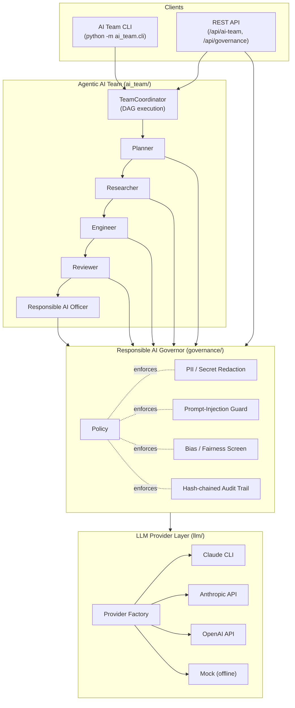
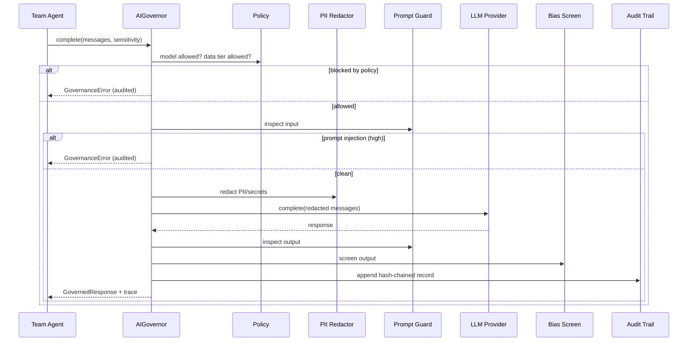
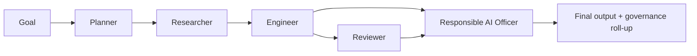

# Agentic AI Platform — Architecture Overview

> Audience: engineering leadership and stakeholders ("the director").
> Goal: explain, in one document, how the agentic AI capabilities are designed,
> how they apply LLMs to real work, and how Responsible AI and security are
> enforced in code — not just on paper.

This document covers three new, composable subsystems added to CodeShield AI:

1. **LLM Provider Layer** (`llm/`) — a swappable interface to language models,
   including the **Claude CLI**.
2. **Responsible AI Governance Layer** (`governance/`) — safety, privacy,
   fairness and accountability controls enforced at runtime.
3. **Agentic AI Team** (`ai_team/`) — a coordinated "team" of role-specialized
   agents that accomplish a goal end-to-end.

These complement the platform's existing security-scanning agent swarm (the HAL
orchestrator) and reuse its conventions.

---

## 1. Why this design

| Goal | How the design meets it |
| --- | --- |
| Practical agentic AI | A real, runnable multi-agent team (`ai_team/`) with explicit, inspectable orchestration. |
| LLMs in real use cases (beyond demos) | A provider abstraction usable by any module, with production backends (Claude CLI, Anthropic, OpenAI) and offline mock. |
| System design & integration | Clean layering: agents → governance → providers. Each layer is independently testable and swappable. |
| Responsible AI (governance, bias, safety) | A dedicated governance layer with policy, prompt-guard, bias screen and a hash-chained audit trail. |
| Security around AI & data handling | PII/secret redaction before data leaves the trust boundary; data-sensitivity gating; allow-listed models. |
| Hands-on with the Claude CLI / EC2 | First-class `ClaudeCLIProvider` and an AWS EC2 deployment guide. |

---

## 2. High-level architecture



**Key principle:** agents never call a model directly. Every call flows through
the **Governor**, which applies Responsible AI controls and then delegates to a
**Provider**. This single choke point is what makes governance reliable.

---

## 3. Request lifecycle (one governed call)



---

## 4. The three layers in detail

### 4.1 LLM Provider Layer (`llm/`)

A small abstraction so the rest of the platform depends on **one interface**,
not a specific vendor SDK.

- `LLMProvider` (abstract): `complete()`, `ask()`, `is_available()`.
- `ClaudeCLIProvider`: invokes `claude -p "<prompt>" --output-format json`.
  Uses the developer's existing Claude login — ideal on a developer laptop or
  an EC2 box, with no API key handling in the app.
- `AnthropicAPIProvider` / `OpenAIAPIProvider`: direct HTTP calls via `httpx`.
- `MockLLMProvider`: deterministic, offline; the universal fallback.
- `get_llm_provider()`: resolves from an explicit name → the
  `CODESHIELD_LLM_PROVIDER` env var → auto-detection, always falling back to
  the mock so nothing hard-fails when a backend is unconfigured.

```python
from llm import get_llm_provider, LLMMessage

provider = get_llm_provider("claude_cli")          # or "anthropic_api", ...
resp = await provider.ask("Explain SSRF in one paragraph")
print(resp.content, resp.usage.total_tokens)
```

### 4.2 Responsible AI Governance Layer (`governance/`)

| Pillar | Module | What it does |
| --- | --- | --- |
| Privacy / Security | `pii.py` | Detects & redacts emails, keys, tokens, cards (Luhn-validated), etc. before prompts leave the boundary. Re-hydration available for trusted callers. |
| Safety | `prompt_guard.py` | Scores prompt-injection / jailbreak attempts on input and detects leaked-instruction signals on output. |
| Fairness | `bias.py` | Flags generalizations, demeaning comparisons and toxic language. |
| Accountability | `audit.py` | Append-only JSONL where each record stores the previous record's hash (tamper-evident chain, `verify()`). |
| Governance | `policy.py` | One declarative `ResponsibleAIPolicy` (with a `strict()` preset) the governor enforces. |

The `AIGovernor` composes these and returns a `GovernedResponse` carrying both
the model output and a `GovernanceTrace` (what was redacted, what fired, whether
human review is required).

### 4.3 Agentic AI Team (`ai_team/`)

A "team" of role-specialized agents executed in dependency order by the
`TeamCoordinator`. Each role is declarative data (`RoleSpec`): identity, system
prompt, and the **data-sensitivity tier** it operates at — which the governor
uses to decide what may leave the boundary.



The run produces a structured transcript plus a governance roll-up (total PII
redacted, which roles need human review, which were blocked) — designed to be
shown to a non-technical stakeholder.

---

## 5. How it integrates with the existing platform

- Reuses `utils.logger`, `utils.config`, and the project's async conventions.
- Mounted into the existing FastAPI app (`main.py`) via a defensively-imported
  router, adding endpoints without touching existing ones.
- The existing AI engines (`ai_triage.py`, `auto_fix.py`) can be migrated onto
  the governed LLM layer incrementally; nothing forces a big-bang change.

---

## 6. Try it

```bash
# Offline (no credentials needed) — deterministic mock backend
python -m ai_team.cli "Design a secure rate limiter for our public API"

# With the Claude CLI (after `claude` is installed and logged in)
python -m ai_team.cli --provider claude_cli "Audit our login flow for risks"

# Strict Responsible AI policy + machine-readable output
python -m ai_team.cli --strict --json "Plan a customer data migration" > run.json
```

See also:
- [`RESPONSIBLE_AI.md`](./RESPONSIBLE_AI.md) — principles, controls, model card.
- [`DEPLOYMENT_AWS_EC2.md`](./DEPLOYMENT_AWS_EC2.md) — running on EC2 with the Claude CLI.
