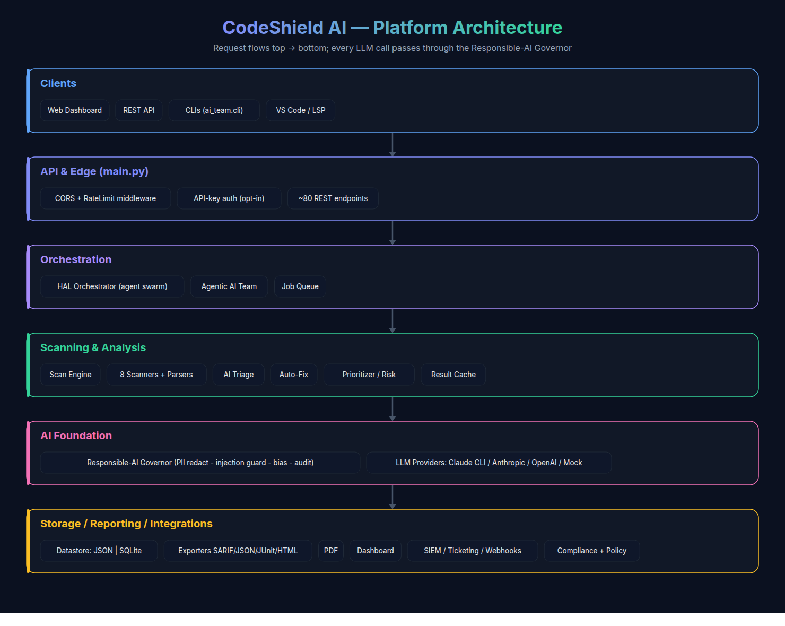
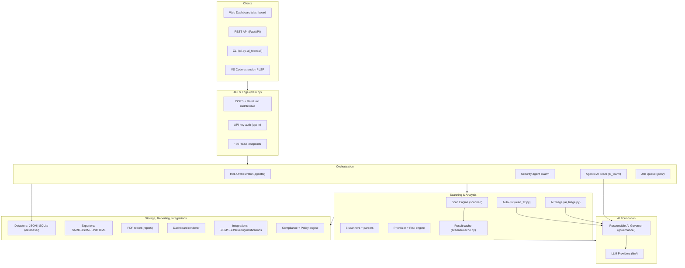
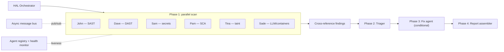
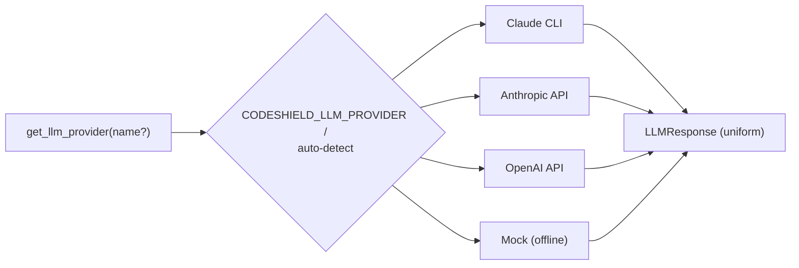
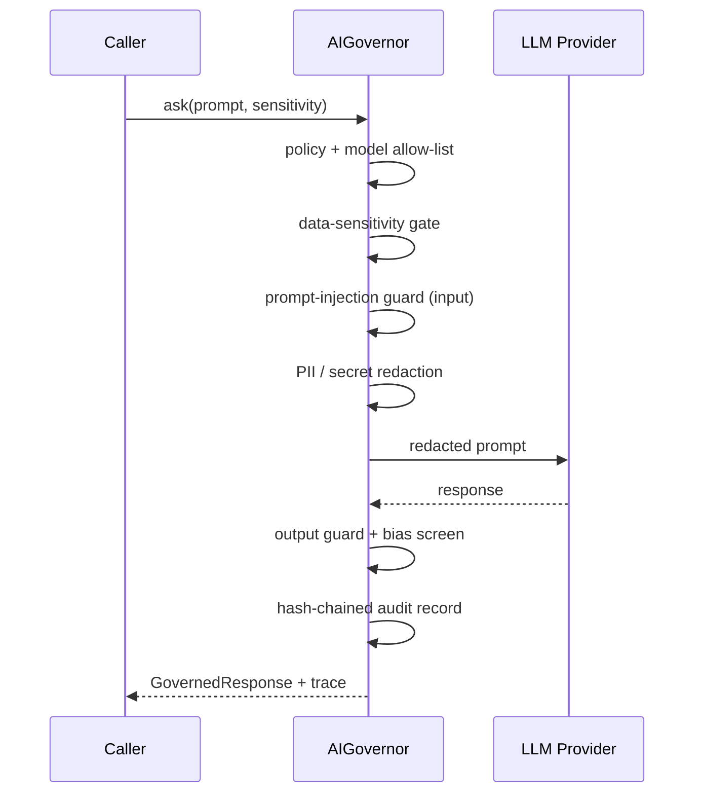
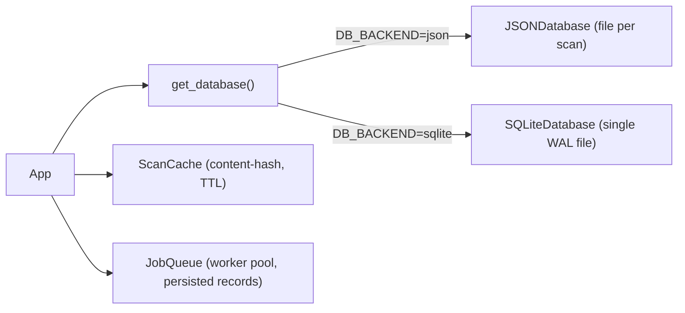
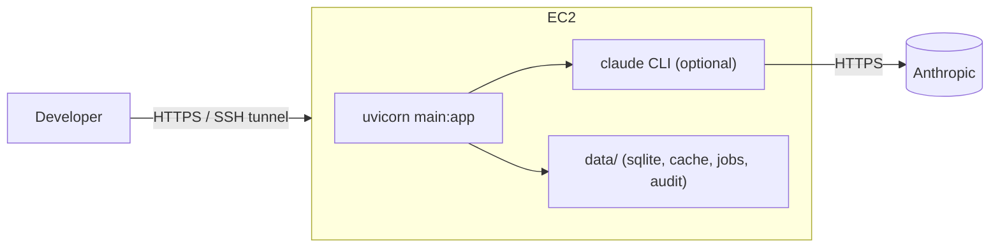

# CodeShield AI — Complete Architecture

This document describes the **whole platform**: every layer, what each component
does, and how a request flows end-to-end. For the agentic-AI-specific deep dive
see [`AGENTIC_AI_ARCHITECTURE.md`](./AGENTIC_AI_ARCHITECTURE.md); for governance
see [`RESPONSIBLE_AI.md`](./RESPONSIBLE_AI.md).

---



## 1. What it is

CodeShield AI is a **FastAPI application-security platform**. You give it code
(ZIP upload or GitHub URL); it detects languages, runs many security scanners in
parallel (coordinated by a multi-agent orchestrator), validates findings with
AI triage, optionally generates fixes, prioritizes by exploitability, and
produces structured results plus PDF/HTML reports — all behind a Responsible-AI
governance layer.

---

## 2. High-level layers



**Core principle:** every LLM call (triage, auto-fix, the AI team, the
`/api/governance` endpoints) goes through the **Governor**, which applies PII
redaction, prompt-injection guards, bias screening, and a hash-chained audit
trail before delegating to a swappable **LLM provider**.

---

## 3. Directory map

| Path | Responsibility |
| --- | --- |
| `main.py` | FastAPI app, ~80 endpoints, middleware, startup/shutdown wiring |
| `scanner/` | Scan engine, language detection, the 8 tool wrappers, `cache.py` |
| `parsers/` | Normalize each tool's raw output into the common `Vulnerability` model |
| `models/` | Pydantic models (`Vulnerability`, `ScanResult`, `ScanConfig`) |
| `agents/` | Multi-agent swarm: HAL orchestrator, bus, registry, health, named agents |
| `ai_team/` | General-purpose agentic "AI team" (Planner/Researcher/Engineer/Reviewer/RAI) |
| `llm/` | LLM provider abstraction (Claude CLI, Anthropic, OpenAI, mock) + factory |
| `governance/` | Responsible-AI: PII redaction, prompt guard, bias, audit, policy, governor |
| `ai_triage.py` | Hybrid heuristic + LLM false-positive reduction |
| `auto_fix.py` | Deterministic + LLM-assisted remediation with unified diffs |
| `prioritizer.py` / `risk_engine.py` | Exploitability/business prioritization & risk scoring |
| `policy_engine.py` | Declarative security gates (block on critical, OWASP, etc.) |
| `database/` | `JSONDatabase`, `SQLiteDatabase`, `get_database()` factory |
| `jobs/` | In-process async job queue with persisted records |
| `auth/` | RBAC, SSO models, opt-in API-key auth + rate limiting |
| `exporters/` | SARIF/JSON/JUnit/HTML exporters + `dashboard.py` renderer |
| `report/` | PDF report generator |
| `cicd/` | Generators for GitHub Actions / GitLab CI / Jenkins / Azure |
| `integrations/` | SIEM, ticketing (Jira/GitHub/Linear/PagerDuty), notifications, GitHub client |
| `compliance/` | Frameworks (SOC2, etc.), compliance reports, SLA tracker |
| `analytics/` | Metrics + dashboard data provider |
| `webhook_engine.py` | Outbound webhooks with circuit breakers |
| `lsp_server.py` | Language Server Protocol server for IDE integration |
| `utils/` | Config (pydantic-settings), structured logging, helpers, CWE/OWASP constants |

---

## 4. End-to-end scan lifecycle

```mermaid
sequenceDiagram
    actor User
    participant API as FastAPI (main.py)
    participant DB as Datastore
    participant ENG as Scan Engine
    participant TOOLS as Scanners (parallel)
    participant TRI as AI Triage -> Governor -> LLM
    participant PRIO as Prioritizer/Risk
    participant REP as Report/Exporters

    User->>API: POST /api/scan/zip | /api/scan/github
    API->>DB: create ScanResult (status=running)
    API-->>User: { scan_id }  (async; poll for status)
    API->>ENG: run_scan(scan_id, source, config)
    ENG->>ENG: detect languages, (optional) cache lookup
    ENG->>TOOLS: run selected scanners concurrently
    TOOLS-->>ENG: raw outputs -> parsers -> Vulnerability[]
    ENG->>TRI: validate findings (cut false positives)
    TRI-->>ENG: triaged findings (+ governance audit)
    ENG->>PRIO: score & rank (severity, exposure, exploitability)
    ENG->>DB: save ScanResult (status=completed, risk_score)
    User->>API: GET /api/scan/{id}/results
    User->>API: GET /api/export/{id}?format=html | report/pdf
    API->>REP: render report
    REP-->>User: SARIF / JSON / JUnit / HTML / PDF
```

The same scan can also be driven through the **HAL orchestrator** (multi-phase,
cross-referencing agents) for a richer, agent-coordinated run.

---

## 5. Multi-agent security swarm (`agents/`)



How it works:
- **Orchestrator (`orchestrator.py`)** runs 4 phases: parallel scanning →
  triage → (conditional) fix → report. It supports adaptive prioritization,
  cross-referencing (same finding from 2+ agents = higher confidence), and
  human-in-the-loop approval for critical findings.
- **Bus (`bus.py`)** is a priority async message bus (fixed: monotonic
  tiebreaker so equal-priority messages never deadlock the dispatch loop).
- **Registry + health (`registry.py`, `health.py`)** track agents and degrade
  them on heartbeat timeout.
- Each named agent wraps a scanner and returns a standardized `AgentResult`.

---

## 6. AI subsystems

| Module | What it does | LLM? |
| --- | --- | --- |
| `ai_triage.py` | Reduces false positives via heuristics (test files, validation present, user-controllability) then an optional LLM verdict. | via Governor |
| `auto_fix.py` | Pattern-based fixes (SQLi→parameterized, XSS→textContent, MD5→SHA-256, secrets→env) + optional LLM fix, validated (syntax + pattern removed) with a unified diff. | via Governor |
| `prioritizer.py` | Combines severity, exposure (endpoint/auth/user-input), threat intel, and business impact into a 0-100 score → P0–P4 bands. | no |
| `risk_engine.py` | Aggregate repo risk score. | no |
| `policy_engine.py` | Declarative gates (block critical, OWASP category, high-count, SQLi, scan-required) with scope filtering. | no |

`ai_triage` and `auto_fix` call the LLM through `governance.assist.governed_complete()`,
which means **any provider** works and every prompt is redacted + audited.

---

## 7. LLM provider layer (`llm/`)



- One interface (`LLMProvider`) → `LLMResponse`. Providers: **Claude CLI**
  (shells out to `claude -p ... --output-format json`), Anthropic & OpenAI
  (HTTP via httpx, no SDK), and a deterministic **mock**.
- `get_llm_provider()` resolves from explicit name → `CODESHIELD_LLM_PROVIDER`
  env → auto-detect, always **falling back to mock** if nothing is usable.

---

## 8. Responsible-AI governance (`governance/`)



Controls: `pii.py` (redaction), `prompt_guard.py` (injection/jailbreak),
`bias.py` (fairness/toxicity), `audit.py` (tamper-evident JSONL chain),
`policy.py` (`ResponsibleAIPolicy`, with a `strict()` preset), composed by
`governor.py`. `assist.py` is the bridge used by the engines.

---

## 9. Agentic AI Team (`ai_team/`)

A general-purpose team — **Planner → Researcher → Engineer → Reviewer →
Responsible-AI Officer** — run in dependency order by a coordinator; each member
calls the LLM only through the Governor. Run it via
`python -m ai_team.cli "<goal>"` or `POST /api/ai-team/run`.

---

## 10. Storage & infrastructure



- **Datastore**: pluggable `JSONDatabase` (default) or `SQLiteDatabase`
  (single WAL-mode file; better concurrency/listing/stats). Same async API.
- **Cache** (`scanner/cache.py`): SHA-256 of source contents + config signature
  → skip re-scanning identical inputs (TTL'd).
- **Job queue** (`jobs/`): bounded-concurrency in-process worker pool with
  disk-persisted job records (no Redis); swappable for Celery/RQ later.

---

## 11. Security of the platform

- **API-key auth** (`auth/api_key.py`): opt-in via `REQUIRE_API_KEY` +
  `API_KEYS`; enforced through the `require_api_key` dependency (X-API-Key /
  Bearer).
- **Rate limiting**: token-bucket `RateLimitMiddleware`, opt-in via
  `RATE_LIMIT_PER_MINUTE` (429 on exceed).
- **RBAC / SSO**: `auth/rbac.py`, `auth/models.py`, `integrations/sso.py`.
- **Data handling**: PII/secret redaction before any prompt egress; audit trail.
- Path-traversal-safe ZIP handling; secrets via env / SSM.

---

## 12. Reporting, delivery & integrations

- **Exporters** (`exporters/`): SARIF, JSON, JUnit, and a modern responsive
  **HTML report** (inline SVG charts, search/filter, light/dark).
- **Dashboard** (`exporters/dashboard.py`, `GET /dashboard`): server-rendered
  history + stats.
- **PDF** (`report/pdf_generator.py`): charts, snippets, OWASP matrix.
- **CI/CD generators** (`cicd/`): GitHub Actions, GitLab CI, Jenkins, Azure.
- **Integrations** (`integrations/`): SIEM, ticketing (Jira/GitHub/Linear/
  PagerDuty), notifications; **webhooks** with circuit breakers.
- **Compliance** (`compliance/`): SOC2 etc. reports, SLA tracking.
- **IDE**: `lsp_server.py` (LSP) + the `vscode_extension/`.

---

## 13. Configuration reference (env vars)

| Variable | Default | Purpose |
| --- | --- | --- |
| `DB_BACKEND` | `json` | `json` or `sqlite` |
| `DB_PATH` | `<data_dir>/codeshield.db` | SQLite file path |
| `CODESHIELD_LLM_PROVIDER` | auto | `claude_cli` / `anthropic_api` / `openai_api` / `mock` |
| `ANTHROPIC_API_KEY` / `OPENAI_API_KEY` | – | API backends |
| `REQUIRE_API_KEY` / `API_KEYS` | off | API-key auth |
| `RATE_LIMIT_PER_MINUTE` | `0` (off) | per-client rate limit |
| `JOB_CONCURRENCY` | `2` | job-queue workers |
| `HOST` / `PORT` / `CORS_ORIGINS` | – | server |
| `LOG_LEVEL` / `LOG_FORMAT` | `INFO` / `json` | logging |

---

## 14. Deployment

- **Local / EC2**: `uvicorn main:app` (see `docs/DEPLOYMENT_AWS_EC2.md` for a
  secure EC2 + Claude CLI walkthrough).
- **CI**: `.github/workflows/ci.yml` runs the test suite (Python 3.11/3.12).
- **Data**: `data/` (JSON store / SQLite / cache / jobs / audit log) — gitignored.



---

## 15. One-paragraph summary

A request enters FastAPI (optionally authenticated + rate-limited), creates a
`ScanResult`, and triggers the **Scan Engine** (or **HAL orchestrator**), which
runs the 8 scanners in parallel, normalizes findings to a common model,
de-duplicates/cross-references them, validates with **AI triage**, optionally
generates **auto-fixes**, and **prioritizes** by risk — every LLM step passing
through the **Responsible-AI Governor** over a swappable **LLM provider**.
Results persist to the **datastore** (JSON or SQLite), are cached by content
hash, and are delivered as JSON/SARIF/JUnit/**HTML**/PDF, surfaced on the
**dashboard**, and pushed to SIEM/ticketing/webhooks — with policy gates,
compliance reports, and an audit trail throughout.
