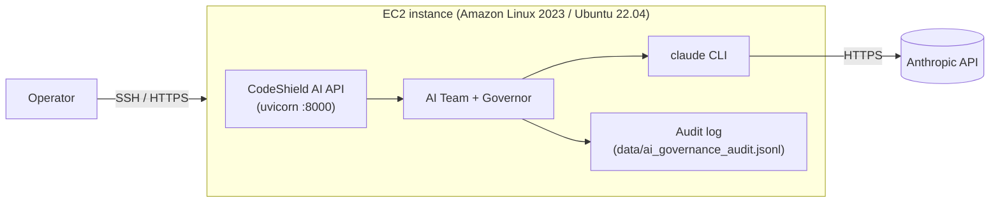

# Deploying the Agentic AI Team on AWS EC2 (with the Claude CLI)

A practical, security-conscious walkthrough for running the agentic AI team on a
single EC2 instance and experimenting with the Claude CLI — the hands-on setup
referenced in the project goals.

> This is a reference guide for a small/PoC deployment. For production, put the
> API behind a load balancer + TLS, use a process manager, and store secrets in
> AWS Secrets Manager / SSM Parameter Store.

---

## 1. Topology



---

## 2. Provision the instance

- **AMI:** Amazon Linux 2023 or Ubuntu 22.04 LTS.
- **Type:** `t3.small` is enough for the mock/CLI workflow; `t3.medium`+ if you
  run the security scanners too.
- **Security group (least privilege):**
  - Inbound `22/tcp` from **your IP only**.
  - Inbound `8000/tcp` only if you must reach the API directly; prefer SSH
    tunneling (`ssh -L 8000:localhost:8000 ...`) and keep `8000` closed.
  - Outbound `443/tcp` (so the Claude CLI / APIs can reach their endpoints).
- **IAM role:** attach a role granting only what you need (e.g. read a specific
  SSM parameter for secrets). Do **not** put API keys in user-data.

---

## 3. Install dependencies

```bash
# System packages
sudo dnf install -y git python3.12 nodejs   # Amazon Linux 2023
# (Ubuntu: sudo apt-get update && sudo apt-get install -y git python3 python3-venv nodejs npm)

# App
git clone https://github.com/<org>/CodeShield-AI.git
cd CodeShield-AI
python3 -m venv .venv && source .venv/bin/activate
pip install -r requirements.txt

# Claude CLI (Claude Code)
npm install -g @anthropic-ai/claude-code
claude --version
```

---

## 4. Configure credentials securely

Choose **one** path:

**A. Claude CLI session (recommended for PoC).** Authenticate the CLI once; the
app shells out to it and never handles the key:

```bash
claude            # follow the login prompt, then exit
export CODESHIELD_LLM_PROVIDER=claude_cli
```

**B. API key via SSM Parameter Store (no plaintext on disk):**

```bash
export ANTHROPIC_API_KEY="$(aws ssm get-parameter \
  --name /codeshield/anthropic_api_key --with-decryption \
  --query Parameter.Value --output text)"
export CODESHIELD_LLM_PROVIDER=anthropic_api
```

> Never bake secrets into the AMI, user-data, shell history, or git. Prefer SSM
> Parameter Store / Secrets Manager and an instance IAM role.

---

## 5. Run

```bash
# Smoke test the agentic team from the terminal (uses your configured provider)
python -m ai_team.cli "Draft a runbook for rotating our database credentials"

# Start the API (bind to localhost; reach it via SSH tunnel)
uvicorn main:app --host 127.0.0.1 --port 8000
```

From your laptop:

```bash
ssh -L 8000:localhost:8000 ec2-user@<instance-ip>
curl -s -X POST localhost:8000/api/ai-team/run \
  -H 'content-type: application/json' \
  -d '{"goal":"Design a secure file-upload endpoint","provider":"claude_cli"}' | jq .
```

### Optional: run as a service

```ini
# /etc/systemd/system/codeshield.service
[Unit]
Description=CodeShield AI API
After=network.target

[Service]
WorkingDirectory=/home/ec2-user/CodeShield-AI
Environment=CODESHIELD_LLM_PROVIDER=claude_cli
ExecStart=/home/ec2-user/CodeShield-AI/.venv/bin/uvicorn main:app --host 127.0.0.1 --port 8000
Restart=on-failure
User=ec2-user

[Install]
WantedBy=multi-user.target
```

```bash
sudo systemctl daemon-reload && sudo systemctl enable --now codeshield
```

---

## 6. Security & Responsible AI checklist for EC2

- [ ] SSH restricted to your IP; port `8000` closed (use a tunnel).
- [ ] Secrets in SSM/Secrets Manager, injected as env vars — never on disk/AMI.
- [ ] Instance IAM role scoped to least privilege.
- [ ] Egress limited to `443`.
- [ ] Responsible AI policy reviewed; use `--strict` for sensitive data.
- [ ] Audit log (`data/ai_governance_audit.jsonl`) shipped to CloudWatch Logs
      and its integrity periodically verified (`AuditTrail.verify()`).
- [ ] OS patched; app runs as a non-root user.
- [ ] Data at rest encrypted (EBS encryption enabled).

---

## 7. Cost & teardown

The mock provider is free and offline; LLM calls (Claude/OpenAI) incur usage
costs — cap them with `max_output_tokens` in the policy. Stop or terminate the
instance when idle:

```bash
aws ec2 stop-instances --instance-ids <id>
```
