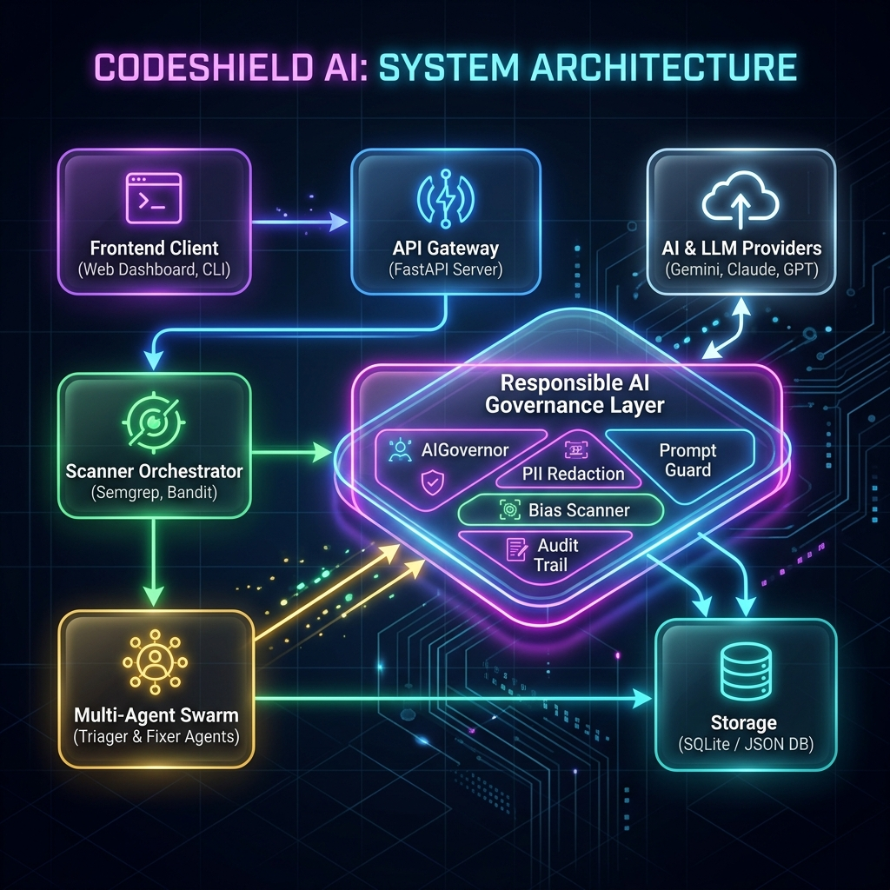
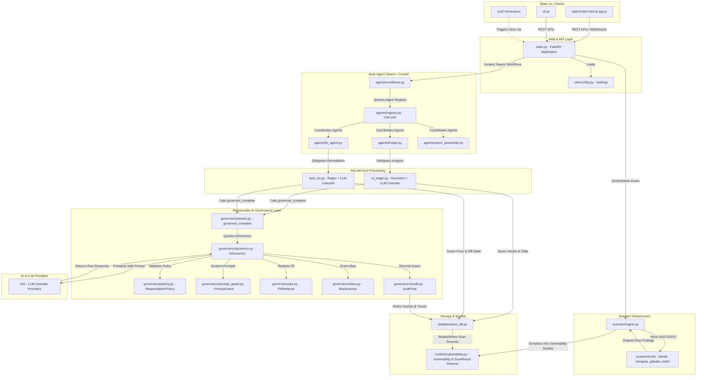
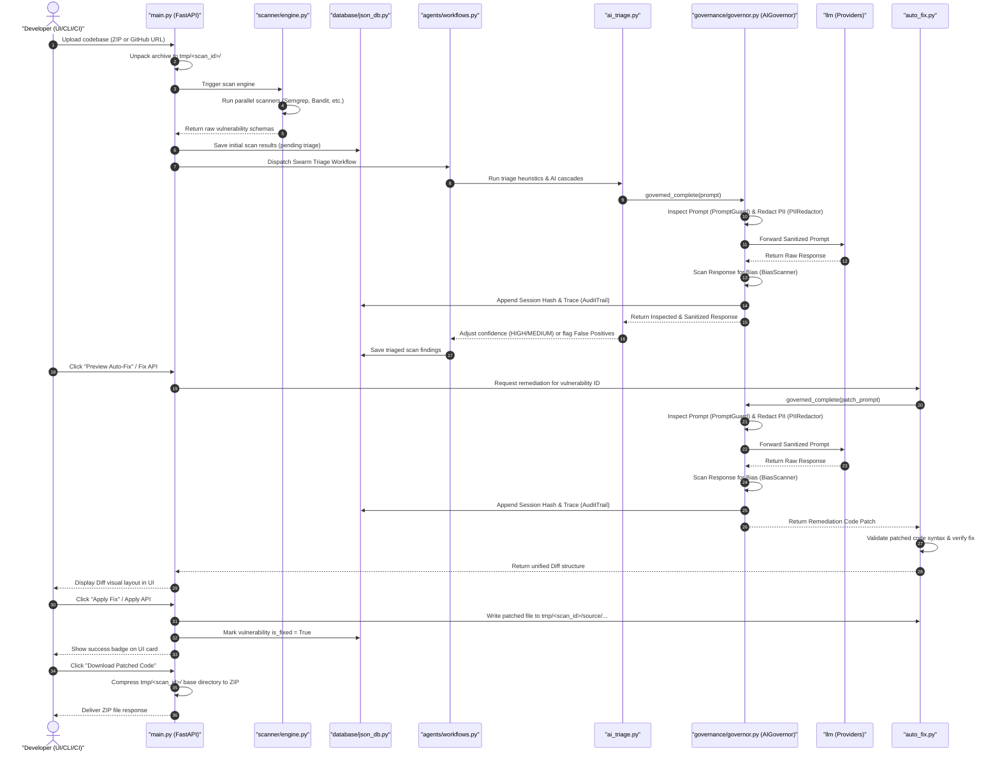

# CodeShield AI - System Architecture & Data Flow

This document details the software architecture, file connections, and multi-agent orchestration workflows within CodeShield AI, incorporating the Responsible AI Governance Layer.

---

## 1. High-Level Architecture Diagram

The diagram below represents how different layers of CodeShield AI (Frontend, FastAPI Backend, Scanner Engine, Multi-Agent Swarm, AI engines, and Database) are connected and pass data.





---

## 2. Component Directory Structure & Key Files

Here is how the project files are structurally organized and connected:

```text
ai-code-sheild/
├── main.py                    # Entrypoint. FastAPI Server routing APIs (scan, fix, triage, download)
├── ai_triage.py               # AI triage engine. Heuristics + LLM cascade (OpenAI, Gemini, Ollama)
├── auto_fix.py                # AI auto-remediation engine (Regex-based + LLM generation, validation & diffs)
├── cli.py                     # CLI tool allowing users to trigger scans and generate reports from terminal
│
├── static/                    # Frontend files served at '/'
│   ├── index.html             # Premium glassmorphic Dashboard HTML
│   ├── styles.css             # Styling for the UI, diff grids, and animations
│   └── app.js                 # JS router making API requests to main.py
│
├── agents/                    # Multi-Agent Swarm (CrewAI based)
│   ├── registry.py            # Dynamic registration, health, and status of active agents
│   ├── workflows.py           # Orchestrates agent handoffs (Triage -> Fix -> Report)
│   ├── triager.py             # Agent wrapper invoking ai_triage.py logic
│   └── fix_agent.py           # Agent wrapper invoking auto_fix.py logic
│
├── scanner/                   # Code scanning modules
│   ├── engine.py              # Orchestrator initializing and running parallel scans
│   └── tools/                 # Tool runners wrapping CLI scanners
│       ├── bandit_scanner.py  # Python SAST scanner
│       ├── semgrep_scanner.py # Multilanguage SAST
│       └── gitleaks_scanner.py# Secret detection
│
├── cicd/                      # CI/CD Pipeline Generators
│   ├── github_action.py       # Outputs GitHub workflow configurations
│   └── jenkins_plugin.py      # Outputs Jenkins scripted and declarative pipeline Groovy code
│
├── database/
│   └── json_db.py             # File-based JSON database engine simulating scan histories
│
└── models/
    └── vulnerability.py       # Pydantic schemas (Vulnerability, ScanResult, is_fixed state)
```

---

## 3. End-to-End Execution Flow

When a user initiates a scan, the data flows step-by-step through the files as follows:



---

## 4. Multi-Agent Swarm Orchestration Mechanics

### The Swarm Lifecycle (`agents/registry.py` & `ai_team/coordinator.py`)
1. **Registration:** When agents start up (using `registry.register_agent`), they publish their `AgentCapabilities` (what tools they own, what programming languages they can write code in, and which vulnerability types they target).
2. **Heartbeats:** Registry monitors dynamic agent health (`HEALTHY`, `BUSY`, `FAILED`) to perform load balancing during high concurrency.
3. **Event Listeners & Orchestration:** The orchestrator listens for status changes to execute workflows asynchronously. The `Coordinator` coordinates agent turns and passes context between them.

### The Agent Swarm Workflow (`agents/workflows.py`)
Instead of running monolithic scans, the work is divided into agent roles:
- **`JohnSAST` / `TinaTaint` (Security Engineers):** Run semantic and static taint analysis to detect flows of untrusted inputs.
- **`TriagerAgent` (Governance Auditor):** Uses `ai_triage.py` to examine the context of security alerts and filter out noise (e.g. flagging code located in test folders as a False Positive).
- **`FixAgent` (Remediation Engineer):** Uses `auto_fix.py` to draft syntactically sound code patches, validate security changes, and produce the diff.
- **`ReportAssembler` (Compliance Writer):** Aggregates findings and generates JSON, HTML, SARIF, or PDF formats for the user.

### Governance Shielding on Agent Actions (`ai_team/agent.py`)
Rather than communicating directly with external models, each agent (`TeamAgent`) interacts through the `Responsible AI Governance Layer`:
1. **Request Interception:** On calling `run()`, the agent builds a prompt and queries `AIGovernor.ask()` with its dynamic `RoleSpec` system prompt and data `sensitivity` level.
2. **PII and Secret Protection:** The `PIIRedactor` censors sensitive artifacts (e.g. passwords, hardcoded keys, API keys, developer emails) in the input/output codebase contexts.
3. **Prompt Injection Prevention:** The `PromptGuard` evaluates prompts against adversarial inputs before forwarding them to `llm/` providers.
4. **Bias and Policy Scanning:** On LLM return, `BiasScanner` validates output safety. Any policy violation triggers a `GovernanceError`, blocking execution.
5. **Traceability:** Step outcomes report a `requires_human_review` status and map structural trace logs.
6. **Cumulative Governance Rollup:** The `Coordinator` aggregates all individual step traces into a central scan audit log (`governance_rollup()`) for compliance verification.
